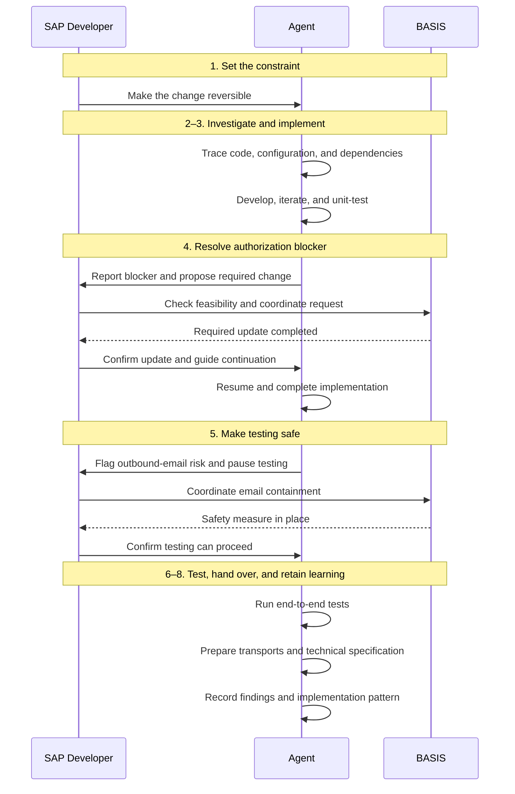

If an agent can investigate your custom code, propose a solution, write it, and run the tests, what exactly is the SAP developer supposed to do?

I think a fairly ordinary change request gives us a useful way to answer that.

One of our clients wanted to improve a purchase requisition approval email. The workflow behind it was 14 years old. Its original developer had left, and nobody on the current team knew it particularly well.

The request was to put the PR details in the email and add a button that opened the right requisition. Reasonable enough. Surely we could save the approver another trip through the SBWP inbox?

The work involved investigating old code, trying approaches that did not work, resolving an authorization blocker, and discovering that the sandbox could still email real users.

The client used Adri for this work. I am affiliated with Adri, so it is the example I know firsthand. What interests me here is how the work was divided between the agent, the developer, and BASIS, and what that suggests about our roles as agents enter the SDLC.

## What was the actual requirement?

The approver needed a rich HTML email containing:

- The PR number, requisitioner, created-by, supplier, purchasing group, plant, and total value.
- A table of line items.
- A working deep link that opened SAP Web GUI on the PR release screen, ME54N, for that specific requisition.

Making this work meant changing workflow nodes, creating workflow containers, and integrating with the existing email infrastructure. In this landscape, the required direct navigation was not available out of the box.

## How did the work unfold?

### Step 1. Decide what must be true about the change.

The developer made one requirement non-negotiable: the change had to be easy to reverse.

The existing workflow worked. The team did not know it deeply. If the new implementation behaved unexpectedly, they needed a clear way back.

The agent could identify technical concerns, but the developer ranked this one above the rest and made it a success criterion. Before delegating the implementation, someone had to decide what an acceptable solution looked like in this environment.

### Step 2. Investigate the existing implementation.

The agent traced the custom code and configuration to understand how approvers were identified, which release strategy controlled approval, and how emails were delivered.

This is work a developer would otherwise have to do directly: follow the code, inspect configuration, and connect the pieces.

Finding the email class only gets you so far. The setup that allows those lines of code to work is part of the implementation too.

### Step 3. Develop and test an approach.

The agent worked on a class to generate the email and direct-action button, along with the workflow nodes and containers needed to call it. It also unit-tested the components.

There were failed attempts. The agent built, scrapped, and retried approaches before finding one that fit the system's workflow, configuration, and authorization setup.

Delegating this work did not make the dependencies disappear. It changed who was doing the investigation and implementation as those dependencies surfaced.

### Step 4. Resolve an authorization blocker.

During implementation, the agent found that it could not modify the workflow with the available authorizations. It diagnosed the blocker, prepared a detailed request for BASIS, and paused.

The developer took the request to the relevant stakeholders and checked whether it was viable. A technically sensible request can still conflict with security policy or operational constraints. The developer had to bring those constraints back and guide the next move.

BASIS completed the required update. The agent resumed and finished the remaining implementation.

This handoff is easy to overlook when we describe the task as “the agent changed the workflow.” Someone still had to get the proposed system change assessed and carried out by the team responsible for it.

### Step 5. Make the environment safe for testing.

Before end-to-end testing, the agent identified that the sandbox could still send workflow emails to real users.

Calling it a sandbox does not help much when your test lands in an actual approver's inbox.

The agent stopped and requested a safety measure for outbound email. The developer coordinated with BASIS to establish what the environment could support. BASIS put the measure in place, and testing resumed after confirmation.

In this case, the agent spotted the risk. The developer's responsibility still included deciding when it was safe to continue and coordinating the people who could change the environment.

### Step 6. Test the complete flow.

With the authorization blocker resolved and outbound email contained, the agent ran the end-to-end tests in the sandbox.

The modified workflow, email-generation class, and navigation to the PR could now be tested together.

This distinction matters when assigning work: running a test and deciding whether the available test evidence is sufficient are separate responsibilities. The agent performed the test execution here. A team adopting this workflow still needs to decide who reviews the evidence and accepts the result.

### Step 7. Prepare the handover.

The agent delivered the transports and technical specification. The resulting email included the requisition details and a button to open the relevant PR.

That is where this implementation account ends. It does not establish who approved a production release or imported the transports, so I would not describe this as an agent owning deployment from start to finish.

### Step 8. Retain what was learned.

The agent added its findings, including the organization's email-delivery code pattern, to Adri's knowledge graph.

The useful idea here extends to any documentation setup: keep the implementation and its required configuration discoverable for the next request. Otherwise, the next developer or agent gets to repeat the same investigation.

## Which task was done by whom?

This table describes the work in this case. It is not a proposed staffing model for every SAP project.

| Step                       | Agent                                                                                                         | Developer                                                                                   | BASIS team                                      |
| -------------------------- | ------------------------------------------------------------------------------------------------------------- | ------------------------------------------------------------------------------------------- | ----------------------------------------------- |
| 1. Set the constraint      | Work within the reversibility requirement.                                                                    | Make reversibility a success criterion.                                                     | —                                               |
| 2. Investigate             | Trace custom code, approver identification, release strategy, and email delivery.                             | —                                                                                           | —                                               |
| 3. Implement and unit-test | Develop and iterate on the email class, navigation, workflow nodes, and containers; unit-test the components. | —                                                                                           | —                                               |
| 4. Resolve authorization   | Diagnose the blocker, prepare the request, and resume implementation after the update.                        | Check feasibility with stakeholders and bring constraints back to the agent.                | Complete the required update.                   |
| 5. Prepare safe testing    | Detect the outbound-email risk and pause testing.                                                             | Coordinate the request and decide when it is safe to continue based on the confirmed setup. | Put the outbound-email safety measure in place. |
| 6. Test the full flow      | Run end-to-end tests in the sandbox.                                                                          | —                                                                                           | —                                               |
| 7. Hand over               | Deliver transports and the technical specification.                                                           | —                                                                                           | —                                               |
| 8. Retain the learning     | Record findings and the email-delivery pattern in the knowledge graph.                                        | —                                                                                           | —                                               |

A dash means this account does not describe a separate task for that role at that step. It does not mean review or accountability is unnecessary. The developer's coordination and judgment ran across the work.

## So what changes for the SAP developer or architect?

My takeaway is that the balance of the work changes. A developer can delegate more investigation, implementation, and test execution. That makes it necessary to be explicit about the decisions and checks they continue to own.

Several of these responsibilities will be familiar to experienced developers and architects. Agents make the division of work more visible because one person may now be directing work they did not execute line by line.

### Turn requirements into constraints the agent can act on.

“Improve the approval email” leaves a lot open. “Preserve a clear way back to the working workflow” changes which solutions are acceptable.

The developer in this case supplied that priority. For an architect, the same responsibility extends to defining the system boundaries and constraints within which the agent can work.

### Evaluate proposed changes against the real environment.

The authorization request needed someone who could discuss it with the relevant teams and understand their answer. If the preferred change was not possible, that person also had to guide the next approach.

This requires technical knowledge. To challenge a proposed permission change or an implementation dependency, you need to understand why it is being requested and what it would affect.

### Define what evidence is needed before proceeding.

The sandbox email issue is a concrete example. The team needed confirmation that outbound email was contained before testing could continue.

More broadly, I would want the developer or architect to define what must be reviewed before accepting the change: whether it meets the requirement, respects the authorization controls, and can be reversed as intended. An agent's report that a test passed is an input to that decision.

These are responsibilities I would assign in an agent-assisted workflow; this case does not document every review or approval having taken place.

### Make ownership explicit at the handoffs.

The agent could prepare a request. BASIS could change the environment. The developer connected those activities and decided when work could resume.

The same clarity is needed at release time. Preparing a transport, approving it, and importing it are distinct tasks, even if an agent can help with some of them.

For me, that is the practical question to bring to the next change request: which work can we delegate, what evidence must come back, and who has the authority to let the next step proceed?

In this workflow, the developer had fewer implementation steps to execute personally and still had consequential decisions to make. Knowing the SAP landscape well enough to make those decisions remained part of the job.

---

## What Did the Developer in the Hot Seat Do?

The agent could inspect the system, propose a design, write the code, and run the tests. But someone still had to decide what mattered most when the stakes were real.

The developer made one concern non-negotiable: every change had to be easy to reverse.

There was a good reason. Nobody on the current team had deep knowledge of the 14-year-old workflow. If the new implementation behaved unexpectedly, they needed a clear path back to the known working state. The agent could identify many technical concerns, but the developer ranked this one above the rest and made reversibility a success criterion for the solution.

The developer also became the bridge between the agent and the BASIS team. An LLM can request a technically valid system change that is still impossible in a particular environment because of security policies, platform constraints, or operational limits. The developer took the agent's requests to the relevant stakeholders, checked whether they were viable, brought the constraints back, and guided the next move.

During testing, that meant asking practical questions at every handoff: Can this authorization be granted? Can outbound email be contained safely? If the preferred setup is not possible, what can the environment support instead?

The developer was not manually executing every technical step. The developer was exercising judgment: setting priorities, challenging assumptions, coordinating people, and deciding when it was safe for the agent to continue.
