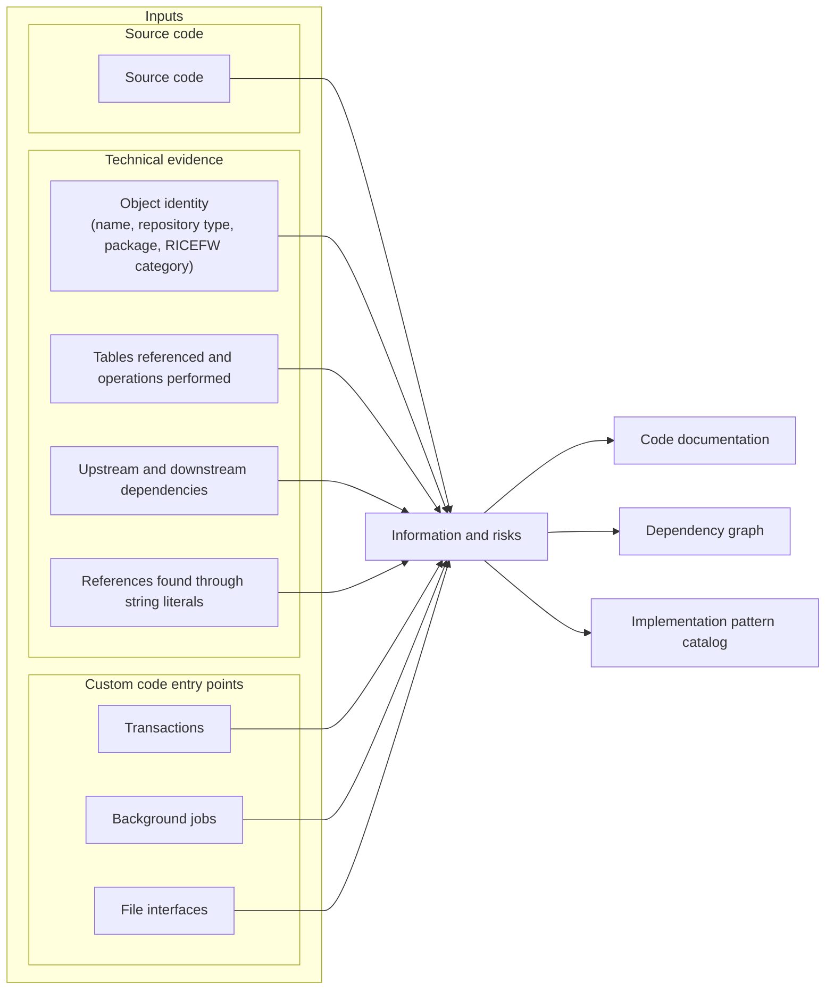

# How is Context Layer created?

## 1. Possible input sources

- ERP systems: ECC, S/4HANA
- SAP Add-ons: CRM, BTP
- Java based systems: PI/PO

---

## 2. Inputs

### 2.1. **Source code and supporting technical evidence**

a. Source code

b. Object identity (name, repository type, package, RICEFW category)

c. Tables referenced and operations performed

d. Upstream and downstream dependencies

e. References found through string literals

### 2.2. Custom code entry points

a. Transactions

b. Background jobs

c. File interfaces

---

## 3. How is a RICEFW object mapped to a business process?

- Does it rely on database tables to identify which module a program belongs to?

---

## 4. At which steps is human oversight required during the Context Layer creation?

Is there human oversight or verification of the knowledge graph after it is created automatically?

---
